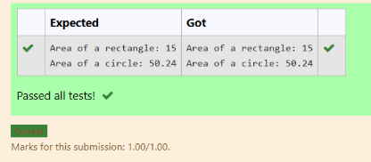

# 🐍 Python OOP: Abstract Class & Method Example

## 🎯 AIM

To create an **abstract class** named `Shape` with an **abstract method** `calculate_area`, and implement this method in two subclasses: `Rectangle` and `Circle`.

---

## 🧠 ALGORITHM

1. **Import ABC module**:
   - Use `from abc import ABC, abstractmethod` to define abstract classes and methods.

2. **Create Abstract Class `Shape`**:
   - Define an abstract method `calculate_area()` with `@abstractmethod`.

3. **Create Subclass `Rectangle`**:
   - Set default values for `length` and `breadth`.
   - Override `calculate_area()` to compute the rectangle area.

4. **Create Subclass `Circle`**:
   - Set default value for `radius`.
   - Override `calculate_area()` to compute the circle area.

5. **Create Objects & Call Methods**:
   - Instantiate `Rectangle` and `Circle`.
   - Call their `calculate_area()` methods.

---

## 💻 Program
```
from abc import ABC
class Shape(ABC):
    def calculate_area(self):
        pass
class Rectangle(Shape):
    length = 5
    breadth =3 
    def calculate_area(self):
        return self.length * self.breadth

class Circle(Shape):
  radius = 4
  def calculate_area(self):
        return self.radius * self.radius*3.14

rec=Rectangle()
cir=Circle()#object created for the class 'Rectangle'
#object created for the class 'Circle'
print("Area of a rectangle:", rec.calculate_area()) #call to 'calculate_area' method defined inside the class 'Rectangle'
print("Area of a circle:", cir.calculate_area()) #call to 'calculate_area' method defined inside the class 'Circle'.
```
## Output



## Result
Thus, the python program is executed successfully.